# Baby AI Game

[](https://travis-ci.org/maximecb/baby-ai-game)

Prototype of a game where a reinforcement learning agent is trained through natural language instructions. This is a research project based at the [Montreal Institute for Learning Algorithms (MILA)](https://mila.quebec/en/).

## Installation

Requirements:
- Python 3.5+
- OpenAI gym
- NumPy
- PyQT5
- PyTorch

Start by manually installing PyTorch. See the [PyTorch website](http://pytorch.org/)
for installation instructions specific to your platform.

Then, install the [minigrid Gym environment](https://github.com/maximecb/gym-minigrid):

```
git clone https://github.com/maximecb/gym-minigrid.git
cd gym-minigrid
pip3 install -e .
cd ..
```

Then, clone this repository and install the other dependencies with `pip3`:

```
git clone https://github.com/maximecb/baby-ai-game.git
cd baby-ai-game
pip3 install -e .
```

#### for this branch specifically
After installing minigrid and baby-ai-game (necessary to access the levels), you need to install [pytorch-a2c-ppo](https://github.com/lcswillems/pytorch-a2c-ppo)

```
git clone https://github.com/lcswillems/pytorch-a2c-ppo.git
cd pytorch-a2c-ppo
pip3 install -e torch_rl
cd ..
```

To train an RL agent, you can do:
```
cd baby-ai-game
cd rl
python -m scripts.train_rl --env BabyAI-OpenDoorColor-v0 --algo ppo
```
More options available in [`train.py`](rl/scripts/train.py)

### For conda users

If you are using conda, you can create a `babyai` environment with all the dependencies by running:

```
conda env create -f environment.yaml
```

Having done that, you can either add `baby-ai-game` and `gym-minigrid` in your `$PYTHONPATH` or install them in the development mode as suggested above.

## Structure of the Codebase

The `levels` directory will contain all the code relevant to the generation of levels and missions. Essentially, this implements the test task for the Baby AI Game. This is an importable module which people can use on its own to perform experiments.

The `agents` directory will contain a default implementation of one or more agents to be evaluated on the baby AI game. This should also be importable as an independent module. Each agent will need to support methods to be provided teaching inputs using pointing and naming, as well as demonstrations.

In `pytorch_rl`, there is an implementation of the A2C, PPO and ACKTR reinforcement learning algorithms. This is a custom fork of [this repository](https://github.com/ikostrikov/pytorch-a2c-ppo-acktr) which has been adapted to work with the `gym-minigrid` environment. This RL implementation has issues and will hopefully be replaced by a better one soon. One important problem, for instance, is that it is not importable as a module.

The `main.py` script implements a template of a user interface for interactive human teaching. The version found in the master branch allows you to control the agent manually with the arrow keys, but it is not currently connected to any model or teaching code. Currently, most experiments are done offline, without a user interface.

## Instructions for Committers

To contribute to this project, you should first create your own fork, and remember to periodically [sync changes from this repository](https://stackoverflow.com/questions/7244321/how-do-i-update-a-github-forked-repository). You can then create [pull requests](https://yangsu.github.io/pull-request-tutorial/) for modifications you have made. Your changes will be tested and reviewed before they are merged into this repository. If you are not familiar with forks and pull requests, I recommend doing a Google or YouTube search to find many useful tutorials on the issue. Knowing how to use git and GitHub effectively are valuable skills for any programmer.

If you have found a bug, or would like to request a change or improvement
to the grid world environment or user interface, please
[open an issue](https://github.com/maximecb/baby-ai-game/issues)
on this repository. For bug reports, please paste complete error messages and describe your system configuration (are you running on Mac, Linux?).

## Usage

To run the interactive UI application:

```
./main.py
```

The environment being run can be selected with the `--env-name` option, eg:

```
./main.py --env-name MiniGrid-Fetch-8x8-N3-v0
```

Basic reinforcement learning code is provided in the `pytorch_rl` subdirectory.
You can perform training using the A2C algorithm with:

```
python3 pytorch_rl/main.py --env-name MiniGrid-Empty-6x6-v0 --no-vis --num-processes 48 --algo a2c
```

In order to Use the teacher environment with pytorch_rl, use the following command :
```
python3 pytorch_rl/main.py --env-name MultiRoom-Teacher --no-vis --num-processes 48 --algo a2c
```

Note: the pytorch_rl code is a custom fork of [this repository](https://github.com/ikostrikov/pytorch-a2c-ppo-acktr),
which was modified to work with this environment.

To see the available environments and their implementation, please have a look at
the [gym_minigrid](https://github.com/maximecb/gym-minigrid) repository.

### Usage at MILA

If you connect to the lab machines by ssh-ing, make sure to use `ssh -X` in order to see the game window. This will work even for a chain of ssh connections, as long as you use `ssh -X` at all intermediate steps. If you use screen, set `$DISPLAY` variable manually inside each of your screen terminals. You can find the right value for `$DISPLAY` by detaching from you screen first (`Ctrl+A+D`) and then running `echo $DISPLAY`.

The code does not work in conda, install everything with `pip install --user`.

### Troubleshooting

If you run into error messages relating to OpenAI gym or PyQT, it may be that the version of those libraries that you have installed is incompatible. You can try upgrading specific libraries with pip3, eg: `pip3 install --upgrade gym`. If the problem persists, please [open an issue](https://github.com/maximecb/baby-ai-game/issues) on this repository and paste a *complete* error message, along with some information about your platform (are you running Windows, Mac, Linux? Are you running this on a MILA machine?).

## About this Project

The Baby AI Game is a game in which an agent existing in a simulated world
will be trained to complete task through reinforcement learning as well
as interactions from one or more human teachers. These interactions will take
the form of natural language, and possibly other feedback, such as human
teachers manually giving rewards to the agent, or pointing towards
specific objects in the game using the mouse.

Two of the main goals of the project are to explore ways in which deep learning can take
inspiration from human learning (ie: how human babies learn), and to research AI learning
with humans in the loop. In particular, language learning,
as well as teaching agents to complete actions spanning many (eg: hundreds)
of time steps, or macro-actions composed of multiple micro-actions, are
still open research problems.

Some possible approaches to be explored in this project include meta-learning
and curriculum learning, the use of intrinsic motivation (curiosity), and
the use of pretraining to give agents a small core of built-in knowledge to
allow them to learn from human agents. With respect to built-in knowledge,
Yoshua Bengio believes that the ability for agents to understand pointing
gestures in combination with language may be key.

You can find here a presentation of the project: [Baby AI Summary](https://docs.google.com/document/d/1WXY0HLHizxuZl0GMGY0j3FEqLaK1oX-66v-4PyZIvdU)

A work-in-progress review of related work can be found [here](https://www.overleaf.com/13480997qqsxybgstxhg#/52042269/)

## The levels

### OpenRedDoor

- Environment: The agent is placed in a room with a door.
- Instruction: Open the red door
- Level id: `BabyAI-OpenRedDoor-v0`
- Evaluate: image understanding

<p align="center">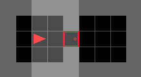</p>

### OpenDoor

- Environment: The agent is placed in a room with 4 different doors. The environment is done when the instruction is executed in the regular mode or when a door is opened in the `debug` mode.
- Instruction: Open a door of:
    - a given color or location in `OpenDoor`
    - a given color in `OpenDoorColor`
    - a given location in `OpenDoorLoc`
- Level id: `BabyAI-OpenDoor-v0`, `BabyAI-OpenDoorDebug-v0`, `BabyAI-OpenDoorColor-v0`, `BabyAI-OpenDoorColorDebug-v0`, `BabyAI-OpenDoorLoc-v0`, `BabyAI-OpenDoorLocDebug-v0`
- Evaluate: image & text understanding, memory in `OpenDoor` and `OpenDoorLoc`

<p align="center">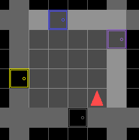</p>

### GoToObjDoor

- Environment: The agent is placed in a room with 4 different doors and 5 different objects.
- Instruction: Go to an object or a door of a given type and color
- Level id: `BabyAI-GoToObjDoor-v0`
- Evaluate: image & text understanding

<p align="center">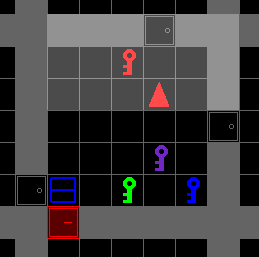</p>

### ActionObjDoor

- Environment: The agent is placed in a room with 4 different doors and 5 different objects.
- Instruction: [Pick up an object] or [go to an object or door] or [open a door]
- Level id: `BabyAI-ActionObjDoor-v0`
- Evaluate: image & text understanding

<p align="center">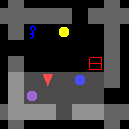</p>

### Unlock

- Environment: The agent is placed in a room with a key and a locked door. The room has either no distractors in `Unlock` or 3 distractors in `UnlockDist`.
- Instruction: Open the door
- Level id: `BabyAI-Unlock-v0`, `BabyAI-UnlockDist-v0`
- Evaluate: image understanding, memory in `UnlockDist`

<p align="center">
    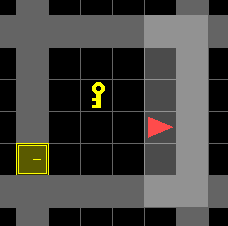
    
</p>

### UnlockPickup

- Environment: The agent is placed in a room with a key and a locked door. The door opens onto a room with a box. Rooms have either no distractors in `UnlockPickup` or 4 distractors in `UnlockPickupDist`.
- Instruction: Pick up an object of a given type and color
- Level id: `BabyAI-UnlockPickup-v0`, `BabyAI-UnlockPickupDist-v0`
- Evaluate: image understanding, memory in `UnlockPickupDist`

<p align="center">
    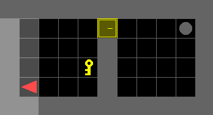
    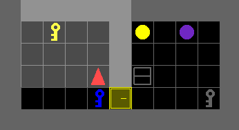
</p>

### BlockedUnlockPickup

- Environment: The agent is placed in a room with a key and a locked door. The door is blocked by a ball. The door opens onto a room with a box.
- Instruction: Pick up the box
- Level id: `BabyAI-BlockedUnlockPickup-v0`
- Evaluate: image understanding

<p align="center"></p>

### UnlockToUnlock

- Environment: The agent is placed in a room with a key of color A and two doors of color A and B. The door of color A opens onto a room with a key of color B. The door of color B opens onto a room with a ball.
- Instruction: Pick up the ball
- Level id: `BabyAI-UnlockToUnlock-v0`
- Evaluate: image understanding

<p align="center">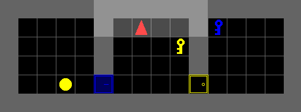</p>

### PickupDist

- Environment: The agent is placed in a room with 5 objects. The environment is done when the instruction is executed in the regular mode or when any object is picked in the `debug` mode.
- Instruction: Pick up an object of a given type and color
- Level id: `BabyAI-PickupDist-v0`, `BabyAI-PickupDistDebug-v0`
- Evaluate: image & text understanding

<p align="center">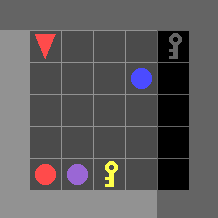</p>

### PickupAbove

- Environment: The agent is placed in the middle room. An object is placed in the top-middle room.
- Instruction: Pick up an object of a given type and color
- Level id: `BabyAI-PickupAbove-v0`
- Evaluate: image & text understanding, memory

<p align="center">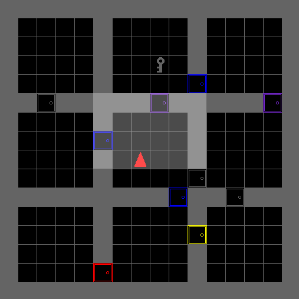</p>

### OpenRedBlueDoors

- Environment: The agent is placed in a room with a red door and a blue door facing each other. The environment is done when the instruction is executed in the regular mode or when the blue door is opened in the `debug` mode.
- Instruction: Open the red door then open the blue door
- Level id: `BabyAI-OpenRedBlueDoors-v0`, `BabyAI-OpenRedBlueDoorsDebug-v0`
- Evaluate: image understanding, memory

<p align="center">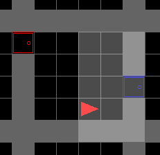</p>

### OpenTwoDoors

- Environment: The agent is placed in a room with a red door and a blue door facing each other. The environment is done when the instruction is executed in the regular mode or when the second door is opened in the `debug` mode.
- Instruction: Open the door of color X then open the door of color Y
- Level id: `BabyAI-OpenTwoDoors-v0`, `BabyAI-OpenTwoDoorsDebug-v0`
- Evaluate: image & text understanding, memory

<p align="center">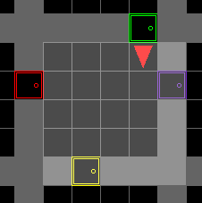</p>

### FindObj

- Environment: The agent is placed in the middle room. An object is placed in one of the rooms. Rooms have a size of 5 in `FindObjS5`, 6 in `FindObjS6` or 7 in `FindObjS7`.
- Instruction: Pick up an object of a given type and color
- Level id: `BabyAI-FindObjS5-v0`, `BabyAI-FindObjS6-v0`, `BabyAI-FindObjS7-v0`
- Evaluate: image understanding, memory

<p align="center">
    
    
    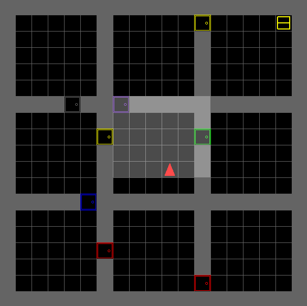
</p>

### FourObjs

- Environment: The agent is placed in the middle room. 4 different objects are placed in the adjacent rooms. Rooms have a size of 5 in `FourObjsS5`, 6 in `FourObjsS6` or 7 in `FourObjsS7`.
- Instruction: Pick up an object of a given type and location
- Level id: `BabyAI-FourObjsS5-v0`, `BabyAI-FourObjsS6-v0`, `BabyAI-FourObjsS7-v0`
- Evaluate: image understanding, memory

<p align="center">
    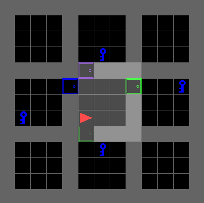
    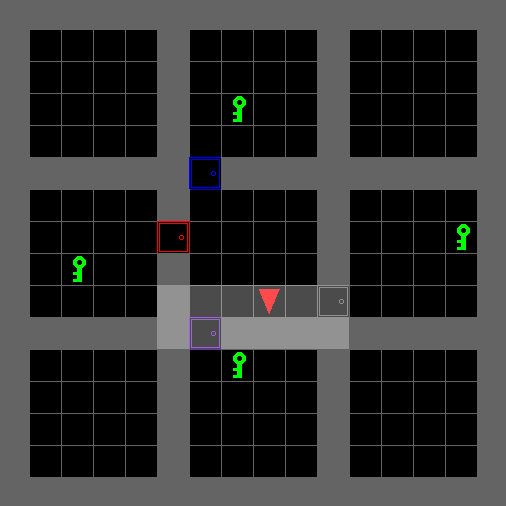
    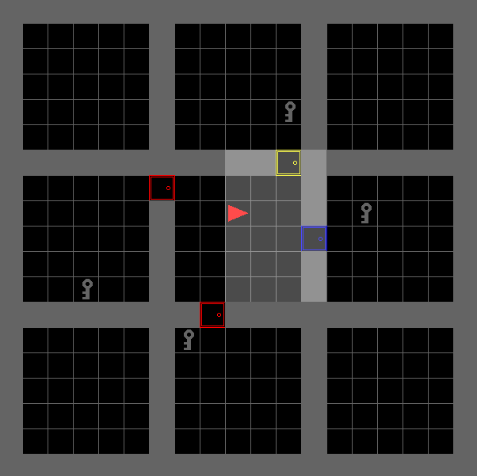
</p>

### HiddenKeyCorridor

- Environment: The agent is placed in the middle of the corridor. One of the rooms is locked and contains a ball. Another room contains a key for opening the previous one.
- Instruction: Pick up an object of a given type
- Level id: `BabyAI-HiddenKeyCorridor-v0`
- Evaluate: image understanding, memory

<p align="center">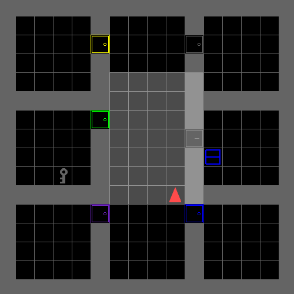</p>

### 1Room

- Environment: The agent is placed in a room with a ball. Rooms have a size of 8, 12, 16 or 20.
- Instruction: Pick up the ball
- Level id: `BabyAI-1RoomS8-v0`, `BabyAI-1RoomS12-v0`, `BabyAI-1RoomS16-v0`, `BabyAI-1RoomS20-v0`
- Evaluate: image understanding, memory

<p align="center">
    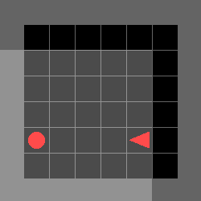
    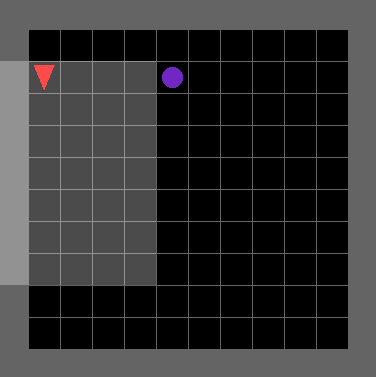
    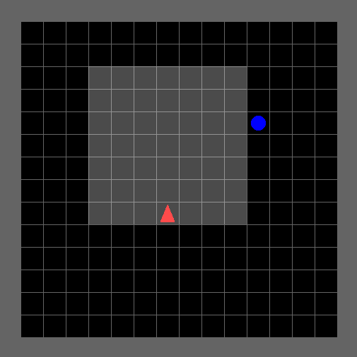
    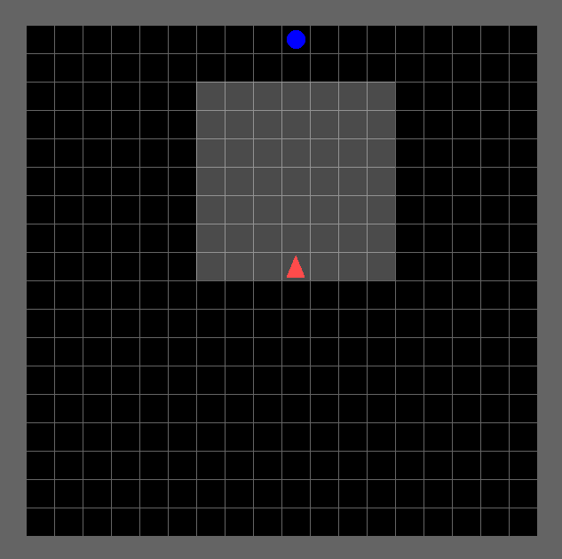
</p>