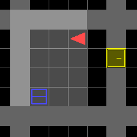

# Baby AI Game

[](https://circleci.com/gh/mila-udem/baby-ai-game/tree/master)

Prototype of a game where a reinforcement learning agent is trained through natural language instructions. This is a research project based at [MILA](https://mila.quebec/en/).

## Installation

Requirements:
- Python 3.5+
- OpenAI gym
- NumPy
- PyQT5
- PyTorch 0.4.1+

Start by manually installing PyTorch. See the [PyTorch website](http://pytorch.org/)
for installation instructions specific to your platform.

Then, clone this repository and install the other dependencies with `pip3`:

```
git clone https://github.com/maximecb/baby-ai-game.git
cd baby-ai-game
pip3 install --process-dependency-links --editable .
```


### Installation using Conda (Alternative Method)

If you are using conda, you can create a `babyai` environment with all the dependencies by running:

```
conda env create -f environment.yaml
```

Having done that, you can either add `baby-ai-game` and `gym-minigrid` in your `$PYTHONPATH` or install them in the development mode as suggested above.

## Structure of the Codebase

In `babyai`:
- The `levels` directory contains all the code relevant to the generation of levels and curriculums. Essentially, this implements the test task for the Baby AI Game. This is an importable module which people can use on its own to perform experiments.
- The `agents` directory contains a default implementation of one or more agents to be evaluated on the baby AI game. This should also be importable as an independent module. Each agent will need to support methods to be provided teaching inputs using pointing and naming, as well as demonstrations.
- The `multienv` directory contains an implementation of the algorithms described in [Matiisen et al., 2017](https://arxiv.org/abs/1707.00183) for automatic execution of curriculums.
- The `utils` directory contains a bunch of useful functions that can be used when training Reinforcement Learning or Imitation Learning agents.
- `model.py` is a script containing the network architectures used when training any type of agent.

In `scripts`:
- `make_human_demos.py` is a helper script to easily make and save human demonstrations that can be helpful for Imitation Learning.
- `train_il.py` is a script used to train an Imitation Learning agent on demonstrations, whether generated by *humans*, or by a Reinforcement Learning agent.
- `train_rl.py` is a script used to train a Reinforcement Learning agent, using the aforementioned `model.py`
- `make_agent_demos.py` takes as input a pre-trained Reinforcement Learning agent (or another type of agent), and generates demonstrations on new instances of the level. These can be used to train an Imitation Learning Agent for example.
- `evalute.py`, `evaluate_all_demos.py`, and `evaluate_all_models.py` are used to obtain basic statistics on the reward an agent obtains, and the number of steps necessary to complete missions within a level.
- `enjoy.py` helps visualize demonstrations or the behavior of a pre-trained RL agent.

The `gui.py` script implements a template of a user interface for interactive human teaching. The version found in the master branch allows you to control the agent manually with the arrow keys, but it is not currently connected to any model or teaching code. Currently, most experiments are done offline, without a user interface.

## Instructions for Committers

To contribute to this project, you should first create your own fork, and remember to periodically [sync changes from this repository](https://stackoverflow.com/questions/7244321/how-do-i-update-a-github-forked-repository). You can then create [pull requests](https://yangsu.github.io/pull-request-tutorial/) for modifications you have made. Your changes will be tested and reviewed before they are merged into this repository. If you are not familiar with forks and pull requests, I recommend doing a Google or YouTube search to find many useful tutorials on the issue. Knowing how to use git and GitHub effectively are valuable skills for any programmer.

If you have found a bug, or would like to request a change or improvement
to the grid world environment or user interface, please
[open an issue](https://github.com/maximecb/baby-ai-game/issues)
on this repository. For bug reports, please paste complete error messages and describe your system configuration (are you running on Mac, Linux?).

## Usage

To run the interactive UI application:

```
./main.py
```

The level being run can be selected with the `--env-name` option, eg:

```
./main.py --env-name BabyAI-UnlockPickup-v0
```


To see the available levels, please have [here](#the-levels)

### Usage at MILA

If you connect to the lab machines by ssh-ing, make sure to use `ssh -X` in order to see the game window. This will work even for a chain of ssh connections, as long as you use `ssh -X` at all intermediate steps. If you use screen, set `$DISPLAY` variable manually inside each of your screen terminals. You can find the right value for `$DISPLAY` by detaching from you screen first (`Ctrl+A+D`) and then running `echo $DISPLAY`.

The code does not work in conda, install everything with `pip install --user`.

### Troubleshooting

If you run into error messages relating to OpenAI gym or PyQT, it may be that the version of those libraries that you have installed is incompatible. You can try upgrading specific libraries with pip3, eg: `pip3 install --upgrade gym`. If the problem persists, please [open an issue](https://github.com/maximecb/baby-ai-game/issues) on this repository and paste a *complete* error message, along with some information about your platform (are you running Windows, Mac, Linux? Are you running this on a MILA machine?).

## About this Project

The Baby AI Game is a game in which an agent existing in a simulated world
will be trained to complete task through reinforcement learning as well
as interactions from one or more human teachers. These interactions will take
the form of natural language, and possibly other feedback, such as human
teachers manually giving rewards to the agent, or pointing towards
specific objects in the game using the mouse.

Two of the main goals of the project are to explore ways in which deep learning can take
inspiration from human learning (ie: how human babies learn), and to research AI learning
with humans in the loop. In particular, language learning,
as well as teaching agents to complete actions spanning many (eg: hundreds)
of time steps, or macro-actions composed of multiple micro-actions, are
still open research problems.

Some possible approaches to be explored in this project include meta-learning
and curriculum learning, the use of intrinsic motivation (curiosity), and
the use of pretraining to give agents a small core of built-in knowledge to
allow them to learn from human agents. With respect to built-in knowledge,
Yoshua Bengio believes that the ability for agents to understand pointing
gestures in combination with language may be key.

You can find here a presentation of the project: [Baby AI Summary](https://docs.google.com/document/d/1WXY0HLHizxuZl0GMGY0j3FEqLaK1oX-66v-4PyZIvdU)

A work-in-progress review of related work can be found [here](https://www.overleaf.com/13480997qqsxybgstxhg#/52042269/)

## The levels

In naming the levels we adhere to the following convention:
- `N2`, `N3`, `N4` refers to the number of objects in the room/environment
- `S2`, `S3`, `S4` refers to the size of the room/environment
- in `Debug` levels the episode is terminated once the agent does something unnecessary or fatally bad, for example
    - picks up an object which it is not supposed to pick up (unnecessary)
    - open the door that it is supposed to open _after_ another one (fatal)
- in `Carrying` levels the agent starts carrying the object of interest
- in `Dist` levels distractor objects are placed to confuse the agent

### OpenRedDoor

- Environment: The agent is placed in a room with a door.
- Instruction: Open the red door
- Evaluate: image understanding
- Level id: `BabyAI-OpenRedDoor-v0`

<p align="center"></p>

### OpenDoor

- Environment: The agent is placed in a room with 4 different doors. The environment is done when the instruction is executed in the regular mode or when a door is opened in the `debug` mode.
- Instruction: Open a door of:
    - a given color or location in `OpenDoor`
    - a given color in `OpenDoorColor`
    - a given location in `OpenDoorLoc`
- Evaluate: image & text understanding, memory in `OpenDoor` and `OpenDoorLoc`
- Level id:
    - `BabyAI-OpenDoor-v0`
    - `BabyAI-OpenDoorDebug-v0`
    - `BabyAI-OpenDoorColor-v0`
    - `BabyAI-OpenDoorColorDebug-v0`
    - `BabyAI-OpenDoorLoc-v0`
    - `BabyAI-OpenDoorLocDebug-v0`

<p align="center"></p>

### GoToDoor

- Environment: The agent is placed in a room with 4 different doors.
- Instruction: Go to a door of a given of a given color.
- Evaluate: image & text understanding
- Level id: `BabyAI-GoToDoor-v0`

### GoToObjDoor

- Environment: The agent is placed in a room with 4 different doors and 5 different objects.
- Instruction: Go to an object or a door of a given type and color
- Evaluate: image & text understanding
- Level id: `BabyAI-GoToObjDoor-v0`

<p align="center"></p>

### ActionObjDoor

- Environment: The agent is placed in a room with 4 different doors and 5 different objects.
- Instruction: [Pick up an object] or [go to an object or door] or [open a door]
- Evaluate: image & text understanding
- Level id: `BabyAI-ActionObjDoor-v0`

<p align="center"></p>

### Unlock

- Environment: The agent is placed in a room with a key and a locked door. The room has either no distractors in `Unlock` or 3 distractors in `UnlockDist`.
- Instruction: Open the door
- Evaluate: image understanding, memory in `UnlockDist`
- Level id:
    - `BabyAI-Unlock-v0`
    - `BabyAI-UnlockDist-v0`

<p align="center">
    
    
</p>

### UnlockPickup

- Environment: The agent is placed in a room with a key and a locked door. The door opens onto a room with a box. Rooms have either no distractors in `UnlockPickup` or 4 distractors in `UnlockPickupDist`.
- Instruction: Pick up an object of a given type and color
- Evaluate: image understanding, memory in `UnlockPickupDist`
- Level id: `BabyAI-UnlockPickup-v0`, `BabyAI-UnlockPickupDist-v0`

<p align="center">
    
    
</p>

### BlockedUnlockPickup

- Environment: The agent is placed in a room with a key and a locked door. The door is blocked by a ball. The door opens onto a room with a box.
- Instruction: Pick up the box
- Evaluate: image understanding
- Level id: `BabyAI-BlockedUnlockPickup-v0`

<p align="center"></p>

### UnlockToUnlock

- Environment: The agent is placed in a room with a key of color A and two doors of color A and B. The door of color A opens onto a room with a key of color B. The door of color B opens onto a room with a ball.
- Instruction: Pick up the ball
- Evaluate: image understanding
- Level id: `BabyAI-UnlockToUnlock-v0`

<p align="center"></p>

### KeyInBox

- Environment: The agent is placed in a room with a box containing a key and a locked door.
- Instruction: Open the door
- Evaluate: image understanding
- Level id: `BabyAI-KeyInBox-v0`

<p align="center"></p>

### PickupDist

- Environment: The agent is placed in a room with 5 objects. The environment is done when the instruction is executed in the regular mode or when any object is picked in the `debug` mode.
- Instruction: Pick up an object of a given type and color
- Evaluate: image & text understanding
- Level id:
    - `BabyAI-PickupDist-v0`
    - `BabyAI-PickupDistDebug-v0`

<p align="center"></p>

### PickupAbove

- Environment: The agent is placed in the middle room. An object is placed in the top-middle room.
- Instruction: Pick up an object of a given type and color
- Evaluate: image & text understanding, memory
- Level id: `BabyAI-PickupAbove-v0`

<p align="center"></p>

### OpenRedBlueDoors

- Environment: The agent is placed in a room with a red door and a blue door facing each other. The environment is done when the instruction is executed in the regular mode or when the blue door is opened in the `debug` mode.
- Instruction: Open the red door then open the blue door
- Evaluate: image understanding, memory
- Level id:
    - `BabyAI-OpenRedBlueDoors-v0`
    - `BabyAI-OpenRedBlueDoorsDebug-v0`

<p align="center"></p>

### OpenTwoDoors

- Environment: The agent is placed in a room with a red door and a blue door facing each other. The environment is done when the instruction is executed in the regular mode or when the second door is opened in the `debug` mode.
- Instruction: Open the door of color X then open the door of color Y
- Evaluate: image & text understanding, memory
- Level id:
    - `BabyAI-OpenTwoDoors-v0`
    - `BabyAI-OpenTwoDoorsDebug-v0`

<p align="center"></p>

### FindObj

- Environment: The agent is placed in the middle room. An object is placed in one of the rooms. Rooms have a size of 5 in `FindObjS5`, 6 in `FindObjS6` or 7 in `FindObjS7`.
- Instruction: Pick up an object of a given type and color
- Evaluate: image understanding, memory
- Level id:
    - `BabyAI-FindObjS5-v0`
    - `BabyAI-FindObjS6-v0`
    - `BabyAI-FindObjS7-v0`

<p align="center">
    
    
    
</p>

### FourObjs

- Environment: The agent is placed in the middle room. 4 different objects are placed in the adjacent rooms. Rooms have a size of 5 in `FourObjsS5`, 6 in `FourObjsS6` or 7 in `FourObjsS7`.
- Instruction: Pick up an object of a given type and location
- Evaluate: image understanding, memory
- Level id:
    - `BabyAI-FourObjsS5-v0`
    - `BabyAI-FourObjsS6-v0`
    - `BabyAI-FourObjsS7-v0`

<p align="center">
    
    
    
</p>

### KeyCorridor

- Environment: The agent is placed in the middle of the corridor. One of the rooms is locked and contains a ball. Another room contains a key for opening the previous one. The level is split into a curriculum starting with one row of 3x3 rooms, going up to 3 rows of 6x6 rooms.
- Instruction: Pick up an object of a given type
- Evaluate: image understanding, memory
- Level ids:
  - `BabyAI-KeyCorridorS3R1-v0`
  - `BabyAI-KeyCorridorS3R2-v0`
  - `BabyAI-KeyCorridorS3R3-v0`
  - `BabyAI-KeyCorridorS4R3-v0`
  - `BabyAI-KeyCorridorS5R3-v0`
  - `BabyAI-KeyCorridorS6R3-v0`

<p align="center">
    
    
    
    
    
    
</p>

### 1Room

- Environment: The agent is placed in a room with a ball. The level is split into a curriculum with rooms of size 8, 12, 16 or 20.
- Instruction: Pick up the ball
- Evaluate: image understanding, memory
- Level ids:
  - `BabyAI-1RoomS8-v0`
  - `BabyAI-1RoomS12-v0`
  - `BabyAI-1RoomS16-v0`
  - `BabyAI-1RoomS20-v0`

<p align="center">
    
    
    
    
</p>

### OpenDoorsOrder

- Environment: There are two or four doors in a room. The agent has to open
 one or two of the doors in a given order.
- Instruction:
  - open the X door
  - open the X door and then open the Y door
  - open the X door after you open the Y door
- Level ids:
  - `BabyAI-OpenDoorsOrderN2-v0`
  - `BabyAI-OpenDoorsOrderN4-v0`
  - `BabyAI-OpenDoorsOrderN2Debug-v0`
  - `BabyAI-OpenDoorsOrderN4Debug-v0`

### PutNext

- Environment: Single room with multiple objects. One of the objects must be moved next to another specific object.
- Instruction: Put the X next to the Y
- Level ids:
  - `BabyAI-PutNextS4N1-v0`
  - `BabyAI-PutNextS5N1-v0`
  - `BabyAI-PutNextS6N2-v0`
  - `BabyAI-PutNextS6N3-v0`
  - `BabyAI-PutNextS7N4-v0`
  - `BabyAI-PutNextS6N2Carrying-v0`
  - `BabyAI-PutNextS6N3Carrying-v0`
  - `BabyAI-PutNextS7N4Carrying-v0`

### MoveTwoAcross

- Environment: Two objects must be moved so that they are next to two other objects. This task is structured to have a very large number of possible instructions.
- Instruction: Put the A next to the B and the C next to the D
- Level ids:
  - `BabyAI-MoveTwoAcrossS5N2-v0`
  - `BabyAI-MoveTwoAcrossS8N9-v0`
